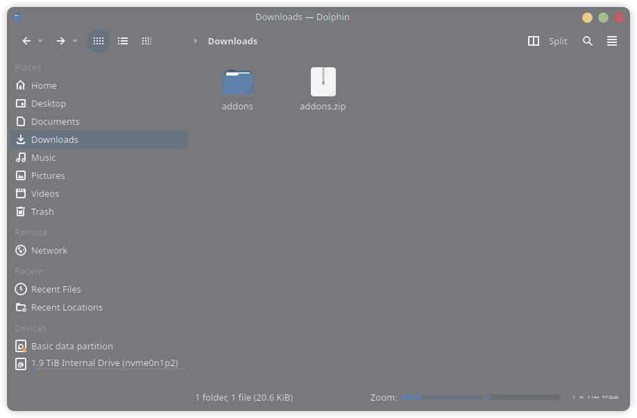
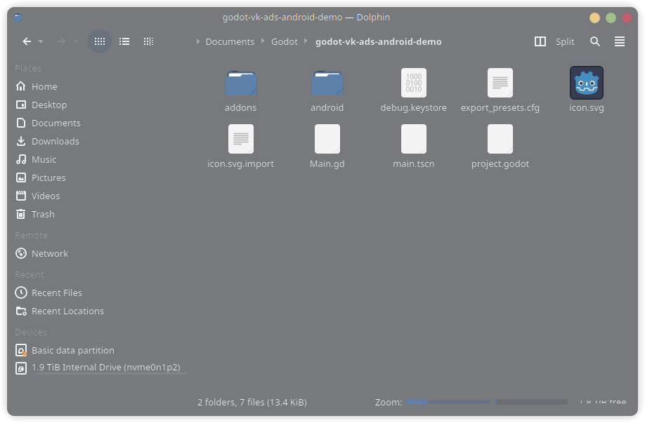
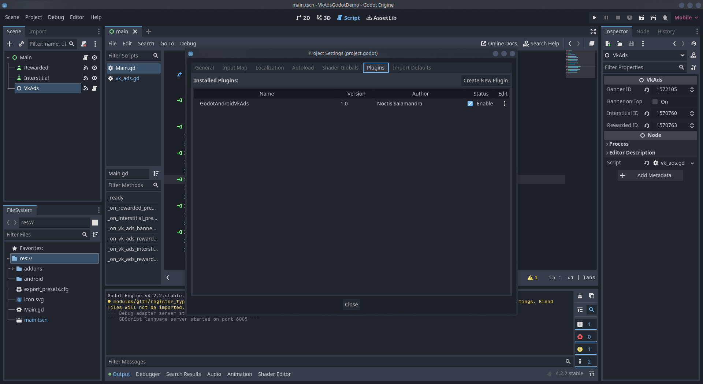
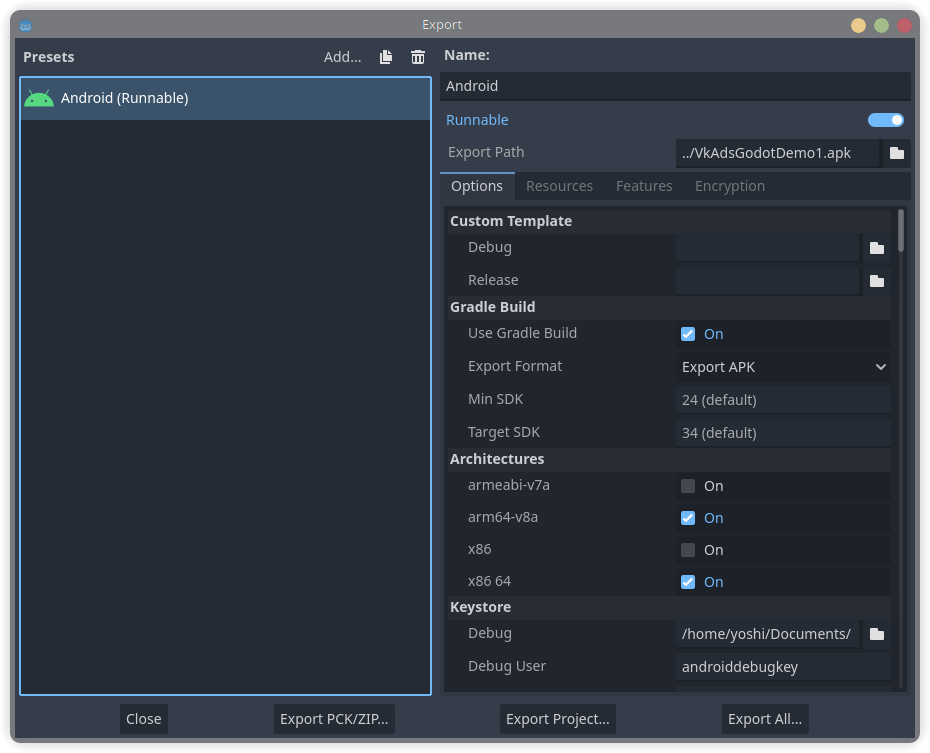
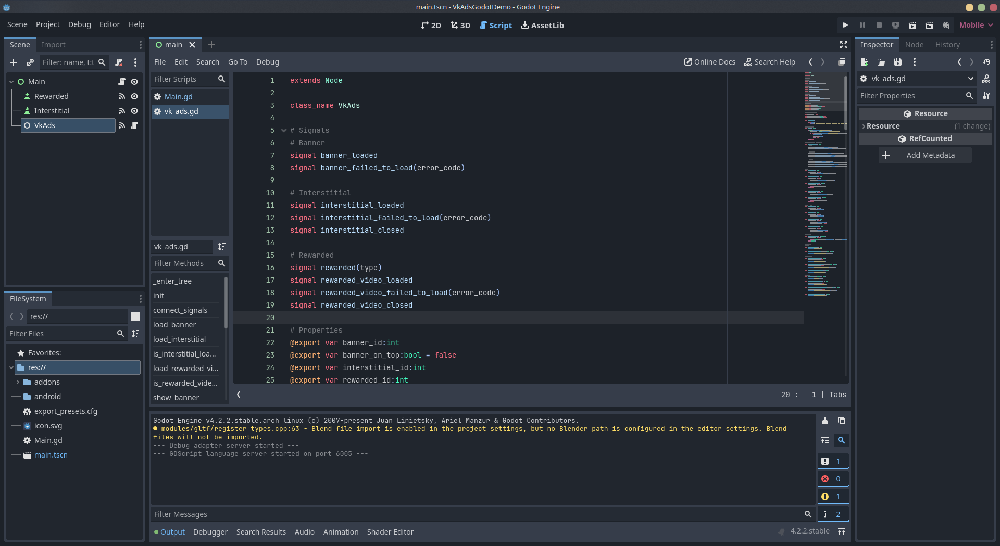
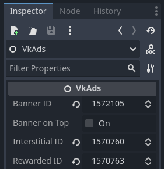
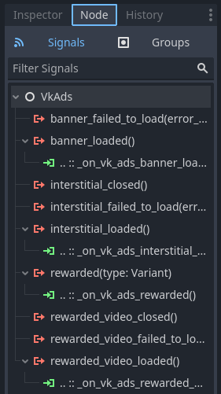

# Godot VkAdsAndroid

This plugin is designed to connect Vk advertising to godot.

## Instruction

### 1. Downloading

Download and unpack this [archive](https://github.com/noctisalamandra/godot-vk-ads-android/releases/latest).



### 2. Distribution by files

Adding a folder to the root section of the project.



### 3. Project Setup

In the project settings, enable the plugin.



When exporting a project, enable "Use Grade Build".



In the "Permissions" section, enable "Access Network State" and "Internet".

Then create a node for the advertising module where you need it and connect the "vk_ads.gd" script, which can be found in the folder that we added.



And insert the ID of your ad.



In build.gradle along the way "android/build/build.gradle" add the following code:

```
dependencies {
    ...
    implementation "com.my.target:mytarget-sdk:5.21.0"
}
```

```
android {

    compileOptions {
        sourceCompatibility JavaVersion.VERSION_1_8
        targetCompatibility JavaVersion.VERSION_1_8
    }
}
```

Then you can use the signals and functions written in the script to display ads.



```
func _ready():
	$VkAds.load_banner()

func _on_rewarded_pressed():
	$VkAds.load_rewarded_video()

func _on_interstitial_pressed():
	$VkAds.load_interstitial()

func _on_vk_ads_banner_loaded():
	$VkAds.show_banner()

func _on_vk_ads_rewarded_video_loaded():
	$VkAds.show_rewarded_video()

func _on_vk_ads_interstitial_loaded():
	$VkAds.show_interstitial()

func _on_vk_ads_rewarded(type):
	pass
```

An example of plug-in connection can be found [here](https://github.com/noctisalamandra/godot-vk-ads-android-demo).