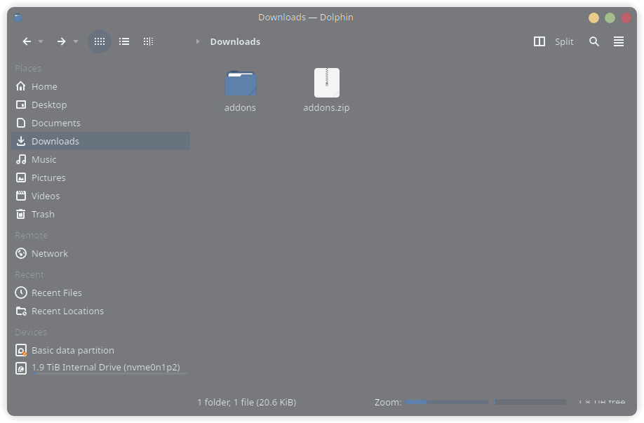
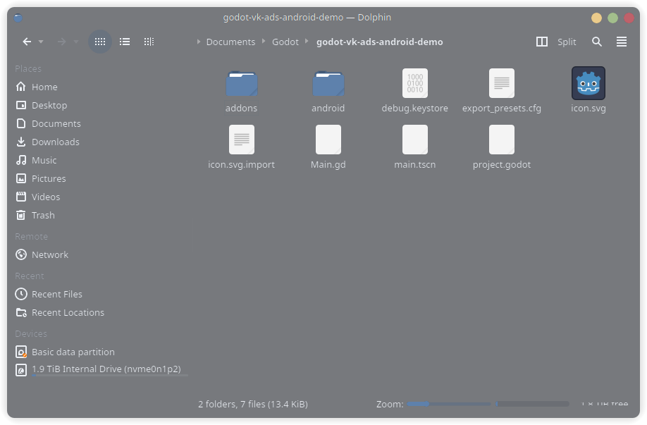
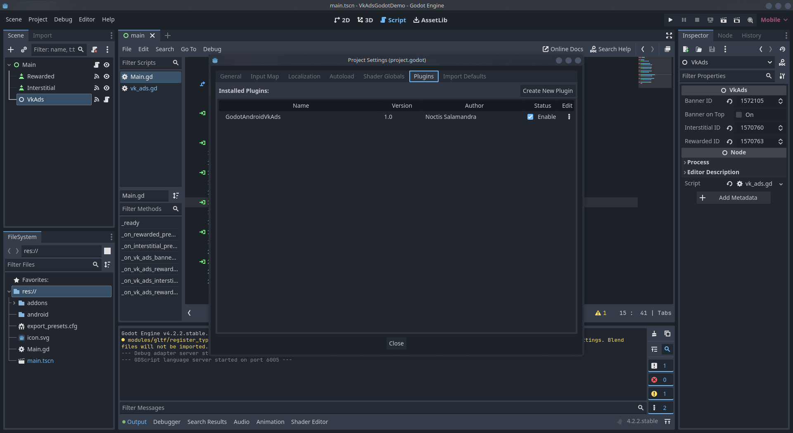
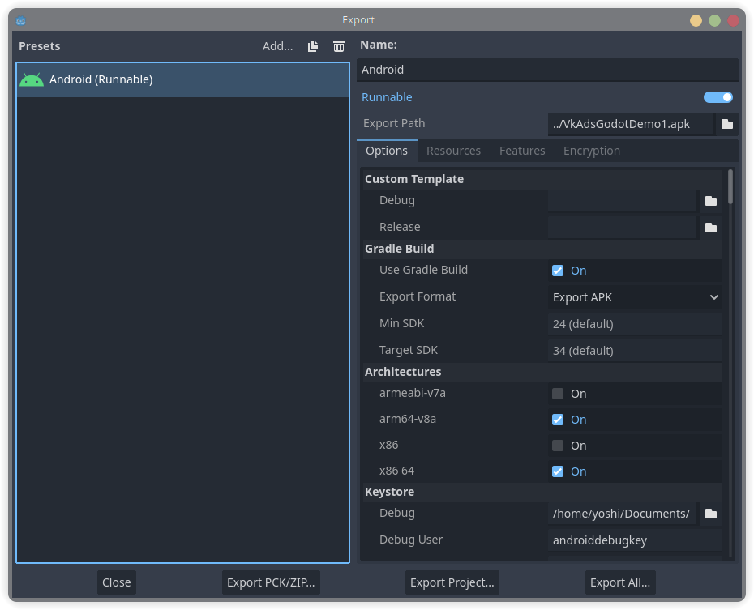
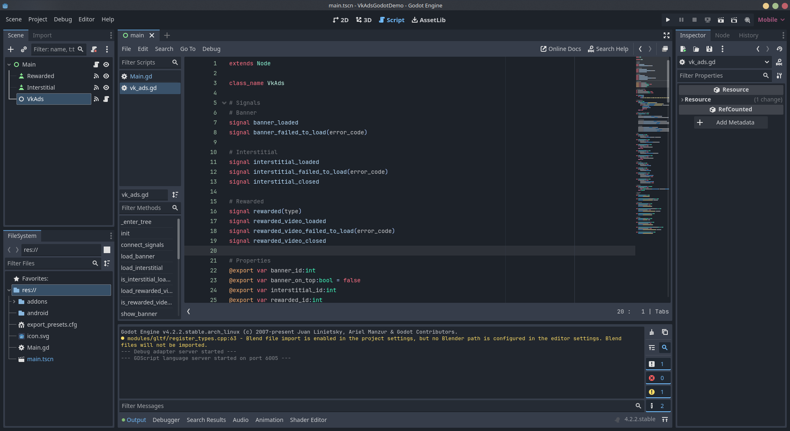
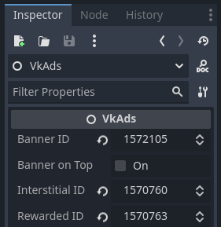
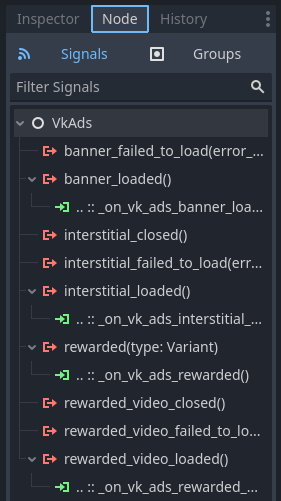

# Godot Android VK Ads

Android-плагин для [Godot 4](https://godotengine.org/), интегрирующий [VK Ads SDK (myTarget)](https://target.my.com/adv/help/sdk/).

Поддерживает баннерную, межстраничную и rewarded-рекламу.

> Работает только на Android. На других платформах плагин ничего не делает.

## Требования

- Godot 4.x
- Экспорт под Android с включённой сборкой через Gradle

---

## Установка

### 1. Скачать

Скачайте и распакуйте последний [архив релиза](https://github.com/noctisalamandra/godot-vk-ads-android/releases/latest).



### 2. Добавить в проект

Скопируйте папку `addons/GodotAndroidVkAds` в корень вашего Godot-проекта.



### 3. Включить плагин

Откройте `Проект → Настройки проекта → Плагины` и включите **GodotAndroidVkAds**.



### 4. Настроить экспорт Android

В настройках экспорта:

- Включите **Use Gradle Build**



- В разделе **Permissions** включите `Access Network State` и `Internet`

### 5. Настроить Gradle

В файле `android/build/build.gradle` добавьте следующее внутрь блока `android {}`:

```groovy
android {
    compileOptions {
        sourceCompatibility JavaVersion.VERSION_17
        targetCompatibility JavaVersion.VERSION_17
    }
}
```

### 6. Добавить узел

Создайте Node в вашей сцене и подключите скрипт `vk_ads.gd` из папки плагина.



---

## Конфигурация

Узел `VkAds` предоставляет следующие экспортируемые свойства:

| Свойство | Тип | Описание |
|---|---|---|
| `banner_id` | `int` | Slot ID для баннерной рекламы |
| `banner_on_top` | `bool` | Показывать баннер сверху (`true`) или снизу (`false`, по умолчанию) |
| `interstitial_id` | `int` | Slot ID для межстраничной рекламы |
| `rewarded_id` | `int` | Slot ID для rewarded-рекламы |

Укажите Slot ID в инспекторе:



---

## API

### Методы

#### Баннер

```gdscript
load_banner() -> void              # Загрузить и отобразить баннер
show_banner() -> void              # Показать скрытый баннер
hide_banner() -> void              # Скрыть баннер (остаётся в памяти)
get_banner_dimension() -> Vector2  # Вернуть размер баннера в пикселях
```

#### Межстраничная реклама

```gdscript
load_interstitial() -> void         # Загрузить межстраничную рекламу
show_interstitial() -> void         # Показать загруженную рекламу
is_interstitial_loaded() -> bool    # Проверить, готова ли реклама
```

#### Rewarded-реклама

```gdscript
load_rewarded_video() -> void         # Загрузить rewarded-рекламу
show_rewarded_video() -> void         # Показать загруженную рекламу
is_rewarded_video_loaded() -> bool    # Проверить, готова ли реклама
```

### Сигналы



#### Баннер

| Сигнал | Аргументы | Описание |
|---|---|---|
| `banner_loaded` | — | Баннер успешно загружен |
| `banner_failed_to_load` | `error_code: int` | Ошибка загрузки баннера |

#### Межстраничная реклама

| Сигнал | Аргументы | Описание |
|---|---|---|
| `interstitial_loaded` | — | Реклама успешно загружена |
| `interstitial_failed_to_load` | `error_code: int` | Ошибка загрузки рекламы |
| `interstitial_closed` | — | Пользователь закрыл рекламу |

#### Rewarded-реклама

| Сигнал | Аргументы | Описание |
|---|---|---|
| `rewarded_video_loaded` | — | Реклама успешно загружена |
| `rewarded_video_failed_to_load` | `error_code: int` | Ошибка загрузки рекламы |
| `rewarded_video_closed` | — | Пользователь закрыл рекламу |
| `rewarded` | `type: String` | Пользователь получил награду |

---

## Пример использования

```gdscript
extends Node

func _ready():
    # Подключить сигналы
    $VkAds.banner_loaded.connect(_on_banner_loaded)
    $VkAds.banner_failed_to_load.connect(_on_banner_failed_to_load)
    $VkAds.interstitial_loaded.connect(_on_interstitial_loaded)
    $VkAds.rewarded_video_loaded.connect(_on_rewarded_video_loaded)
    $VkAds.rewarded.connect(_on_rewarded)

    # Загрузить баннер сразу
    $VkAds.load_banner()

func _on_banner_loaded():
    $VkAds.show_banner()

func _on_banner_failed_to_load(error_code: int):
    print("Ошибка загрузки баннера: ", error_code)

# Вызвать, когда нужно показать межстраничную рекламу
func show_interstitial_ad():
    if $VkAds.is_interstitial_loaded():
        $VkAds.show_interstitial()
    else:
        $VkAds.load_interstitial()

func _on_interstitial_loaded():
    $VkAds.show_interstitial()

# Вызвать, когда нужно показать rewarded-рекламу
func show_rewarded_ad():
    if $VkAds.is_rewarded_video_loaded():
        $VkAds.show_rewarded_video()
    else:
        $VkAds.load_rewarded_video()

func _on_rewarded_video_loaded():
    $VkAds.show_rewarded_video()

func _on_rewarded(type: String):
    print("Награда получена: ", type)
    # Выдать награду игроку здесь
```

---

## Демо-проект

Полный пример проекта доступен [здесь](https://github.com/noctisalamandra/godot-vk-ads-android-demo).

## Лицензия

[MIT](LICENSE)
